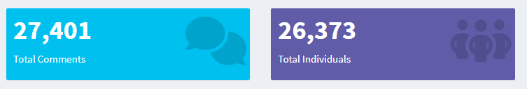
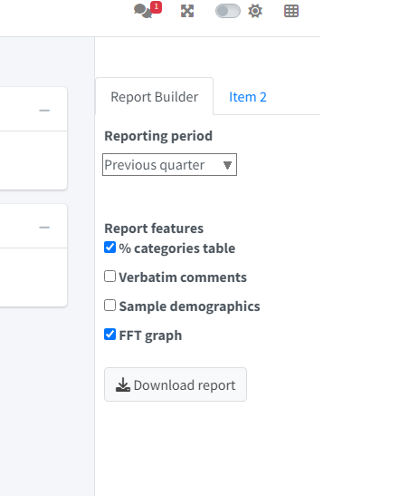
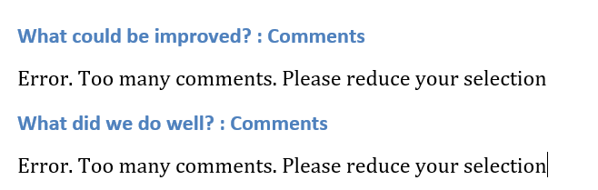
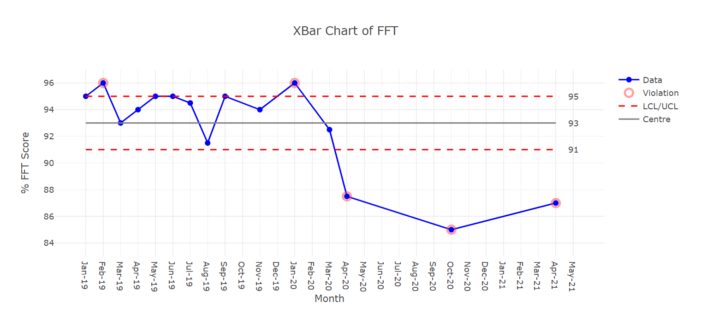
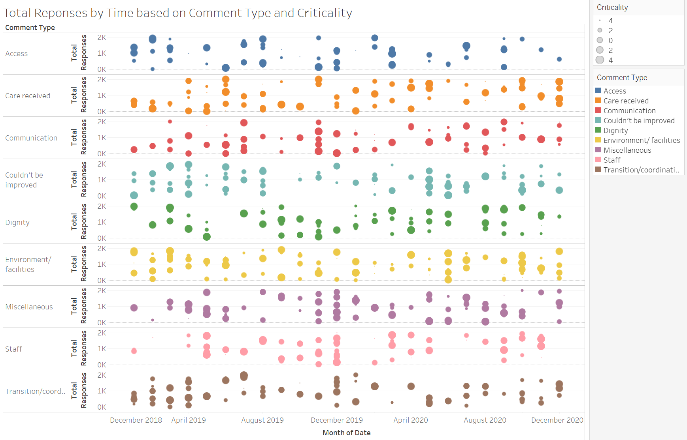
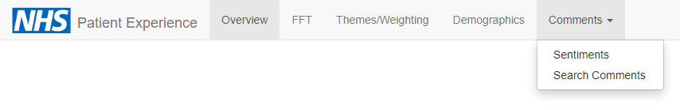

class: title-slide, left, bottom

```{r setup, include = FALSE}
library(knitr)
library(dplyr)
library(kableExtra)

### Packages not on CRAN ###

# install.packages("remotes")
# remotes::install_github("mitchelloharawild/icons")
library(icons) # icons need to be loaded to view so run following code if not already done
# icons::download_fontawesome()

# install.packages("devtools")
#devtools::install_github("gadenbuie/xaringanExtra")
library(xaringanExtra)
xaringanExtra::use_share_again() # need to get the slide button on html view

# set default options
opts_chunk$set(echo = FALSE,
               fig.width = 7.252,
               fig.height = 4,
               dpi = 300,
               dev.args = list(type = "cairo"),
               eval = TRUE,
               warning = FALSE,
               message = FALSE,
               error = FALSE)

```

```{r logo, echo=FALSE}
# Adds logo to all slides

xaringanExtra::use_logo(
  image_url = "https://cdu-data-science-team.github.io/assets/logo/nottshc-cdu-data-science-logo-800.png",
  link_url = "https://cdu-data-science-team.github.io/team-blog/",
  exclude_class = c("inverse", "hide-logo"),
  width = "300px",
  height = "200px",
  position = css_position(top = "0em", right = "-3em")
)
```

# `r rmarkdown::metadata$title`
----
## **`r rmarkdown::metadata$subtitle`**
### `r rmarkdown::metadata$author` | `r format(Sys.time(), '%B %Y')` 

---
name: contents
class: inverse

# CONTENTS

1. [Introduction](#introduction)

2. [Assumptions](#assumptions)

3. [Strengths](#strengths)

4. [Weaknesses](#weaknesses)

5. [Improvements](#improvements)

6. [References](#references)

7. [Acknowledgement](#acknowledgment)

---
name: introduction

# INTRODUCTION

The patient experience dashboard is a part of [NHS Patient Experience Framework](https://assets.publishing.service.gov.uk/government/uploads/system/uploads/attachment_data/file/215159/dh_132788.pdf).

The framework outlines eight critical elements for patients' experience of NHS Service:

* Respect for patient-centered values, preferences, and expressed needs
* Coordination and integration of care
* Information, communication, and education
* Physical comfort
* Emotional support
* Welcoming the involvement of family and friends
* Transition and continuity
* Access to care

Patient Experience Dashboard offers insight into patients' perspectives on the quality, effectiveness, and promptness of care. By displaying patient experience data in one place, the Patient Experience Dashboard makes it easy for NHS staff to check in on patient experience and address problem areas as they arise. These patient insights are helpful in short- and long-term planning and can prove particularly critical as part of a hospital's quality improvement efforts.

This presentation aims to highlight the strengths, weaknesses, and improvements in the existing patient experience dashboard by NHS CDU Data Science Team.

---
name: assumptions

# ASSUMPTIONS

* FTT expands to Friends & Family Test
* The data is gathered from feedback form after the patient's treatment
* For each value of category, a comments section is provided to input manual comments
* Not sure about the calculation & meaning of the *Criticality* field on *Themes/Weighting - Comments* tab
* *'What could be improved?'* & *'What did we do well?'* are categorical variables with the checkbox input
* The intended audience for this dashboard is the departmental leaders and trust leaders of NHS 
* NHS CDU Data Science team follows NHS branding guidelines

## Target Questions

* How do patients rate their satisfaction with each department?
* Do the results indicate that expected outcomes are acheived?
* What are the key areas of improvements in every division/directorate/department?
* Are service users and their families engaged in improving patient experience?

.footnote[
**Footnotes**
* The R expressions/keywords are represented like `this`
* The keywords related to data or dashboard are represented in *italics*
* The errors are represented with .red[red color]
]


---
name: strengths

# STRENGTHS

## In terms of UI

* Flexibility to filter data based on *Division*, *Directorate*, *Team*, and *Date range*
* All tabs in the dashboard responds to the sidebar filters (context filters)
* X-bar chart of Friends & Family test to determine the stability in average FFT score over time
* Ability to download the report with the flexibility to include/exclude required details and period of analysis
* The reactive filtering of metrics based on the above criterion with immediate effect and no dependency on any button
* Appropriate color coding in *Criticality* field for better understanding 
* Flexibility to adjust the graph in *Themes/Weighting - Timeline* tab based on *Total* & *Proportions*
* Identification of sentiments for each comment which can help the user not to read the entire comment and save time
* Filter comments based on category & sentiments
* Ability to search comments based on keywords
* Representation of the count of comments based on diversity  
* Snapshot of data uploaded on the dashboard using *Upload* button

---
name: strengths2

# STRENGTHS - continued...

## In terms of code

* The modular structure of the application enhances scalability
* Implementation of `golem` package provides robustness and simplification of creation, development, and deployment of a shiny application
* The entire code follows standards and code of conduct which enables the rationalisation of code in multiple contributors
* Every call to the function is referenced from its namespace, which will allow the app to identify the function at run time
* Reusability of `ui` and `server` functions for example `mod_text_reactable_ui` & `mod_click_tables_ui` are used for both the cases *'What could be improved?'* & *'What did we do well?'*
* Usage of the `golem-config.yml` file to re-use the same code for different trusts like *'trust-a'*, *'trust-b'*, etc
* The use of `isTruthy()` function from the `shiny` package can handle run time discrepancies in conditions
* Interesting utility functions like `rv()` for `reactiveValues()` and `rvtl()` for `reactiveValuesToList()`
* The use of namespaces `ns()` function to ensure that none of the IDs collide

---
name: weaknesses

# WEAKNESSES

* Time to initial load
* Readability in charts (small fonts, title, labels, etc)
* Formatting of downloaded report
* Error in the comments section: .red[Too many comments] in report
* The visualisations should be self explainable
* The numbers should be validated across the dashboard
* Caching of visualisations and render functions
* Date range adjustment in timeline charts or xbar chart
* Session timeout/disconnection (based on user need)

---
name: improvements

# IMPROVEMENTS

## Summary tab

* The summary tab can be renamed to *'Overview'*
* The new *'Overview'* tab can show a glimpse of the overall dashboard with the visualisation from other tabs as well
* The numbers can be comma separated, i.e., instead of *'There are 27401 comments in the database from 26373 individuals.'* we can show *'There are 27,401 comments in the database from 26,373 individuals.'*
* The simple text can be replaced with `valueBox`



---
name: improvements2

# IMPROVEMENTS - continued...

## Report Builder tab

* The report builder tab is a utility hence it can be moved to a `controlBar` (on the right side of the dashboard)

```{r sidebar_image, echo=FALSE, out.width="300px", out.height="370px", fig.align='center'}

```

---
name: improvements3

# IMPROVEMENTS - continued...

## Report Builder tab

* The downloaded report should be in pdf format (using LaTeX)
* The tables should be formatted in the report, and formatting here includes the names of the columns as well (instead of *'n'* and *'percent'*, we can say *'Count'* and *'Percentage'*)

```{r formatting, echo=FALSE, eval=TRUE}
dummy <- readxl::read_xlsx("www/Data.xlsx", sheet = "Sheet1") %>% dplyr::rename(Count = "n", Percentage = "percent") %>% dplyr::mutate(Count = format(Count, big.mark = ","), Percentage = paste0(Percentage, "%"))
kbl(x = dummy, booktabs = T, longtable = F) %>% 
  kable_styling(full_width = T, position = "center", font_size = 15, bootstrap_options = "bordered") %>% 
  column_spec(1, width = "2.5cm", border_right = T) %>% 
  column_spec(2, width = "1.5cm", border_right = T) %>% 
  column_spec(3, width = "2cm")
```

---
name: improvements4

# IMPROVEMENTS - continued...

## Report Builder tab

* Error in comments section: .red[Error. Too many comments. Please reduce your selection]



* The graphs should be ordered and well formatted in the report

---
name: improvements5

# IMPROVEMENTS - continued...

## FFT tab

* The FFT chart should have custom options to adjust the timeline
* Readability of the graph can be improved
* The graph can be more granular (on month or quarter basis)
* The graph can have the legends

<a href="https://codepen.io/vishalsharma3003/full/bGMGmXY" rel="FFT Chart"></a>

---
name: improvements6

# IMPROVEMENTS - continued...

## Themes/Weighting tab

* The nested tabs are not a good option
* The *Summary* tab can have formatted tables (like comma-separated numbers and appropriate column names)
* The tables can have export options instead of multiple buttons

```{r datatable, echo=FALSE}
themes <-
  readxl::read_xlsx(path = "./www/Data.xlsx", sheet = "Themes_Summary") %>% rename(Count = "n", Percentage = "percent") %>% mutate(Count = format(Count, big.mark =
                                                                                                                                                    ","),
                                                                                                                                   Percentage = paste0(Percentage, "%"))

DT::datatable(
  themes,
  extensions = 'Buttons',
  class = 'cell-border',
  options = list(
    dom = 'Bfrtip',
    buttons =
      list(
        'copy',
        'print',
        list(
          extend = 'collection',
          buttons = c('csv', 'excel', 'pdf'),
          text = 'Download'
        )
      ),
    pageLength = 4
  )
)

```

---
name: improvements7

# IMPROVEMENTS - continued...

## Themes/Weighting tab

* Placeholders should be there in text fields
* The comments tab loads twice, which is not user-friendly; possible modifications can be the argument `init = TRUE` in `observeEvent()` function or the use of `bindCache()` with `renderReactable()`
* *Comments* section takes a lot of time to load; the use of dplyr can be replaced with base r as it is much more efficient

```{r dplyr_vs_baser, eval=FALSE, echo=TRUE}
# dplyr approach
table_comments <- tidy_trust_data_r() %>%
  tidyr::drop_na(crit) %>%
  dplyr::filter(comment_type == comment_select) %>%
  dplyr::select(comment_txt, crit)

# base R approach
table_comments <-
  tidy_trust_data_r()[!is.na(tidy_trust_data_r()$crit) &
                        tidy_trust_data_r()$comment_type == comment_select, c("comment_txt", "crit")]
```

---
name: improvements8

# IMPROVEMENTS - continued...

## Themes/Weighting tab

* A better visualisation can be used in the *Timeline* tab
* The labels on the graph can be improved

```{r timelinegraph, echo=FALSE, out.width="700px", out.height="400px"}

```

---
name: improvements9

# IMPROVEMENTS - continued...

## Sentiment tab

* The *Comments* tab can contain word clouds excluding stop words

```{r wordcloud, echo=FALSE, warning=FALSE, eval=TRUE, out.height="300pt", out.width="700pt", fig.align='left'}
library(wordcloud)
library(RColorBrewer)
library(wordcloud2)
library(tm)

data <-
  readxl::read_xls(
    "./data-raw/TrustB.xls",
    sheet = "Completed Comments",
    range = "G1:G5001",
    col_names = FALSE
  )
text <- data$...1

# Create a corpus
docs <- Corpus(VectorSource(text))

# Clean the text data
docs <- docs %>%
  tm_map(removeNumbers) %>%
  tm_map(removePunctuation) %>%
  tm_map(stripWhitespace)
docs <- tm_map(docs, content_transformer(tolower))
docs <- tm_map(docs, removeWords, stopwords("english"))

# Create a document-term-matrix
dtm <- TermDocumentMatrix(docs)
matrix <- as.matrix(dtm)
words <- sort(rowSums(matrix), decreasing = TRUE)
df <- data.frame(word = names(words), freq = words)

wordcloud2(data = df, size = 0.7, color = 'random-dark')

```

---
name: improvements10

# IMPROVEMENTS - continued...

## Sentiment tab

* The sentiments can be represented with emoticons
* One histogram for review length, which can highlight the engagement & participation of patients in providing reviews
* Bar chart for reviews per division/department can highlight if any department requires more reviews from patients
* Unigram and bigram analysis without stop words
* Sentiments classification for every department
* In the *Timeline* tab, black box on the lower left side

---
name: improvements11

# IMPROVEMENTS - continued...

## Demographics tab

* *Unknown* category should be available in the dropdown if it is included in the graph
* Flexibility for count and proportions can be made available here as well
* The graphs can be well formatted, and branding should be followed
* Age & count chart has *12000* trimmed
* The graphs should be ordered either in ascending or descending order
* The text shows *There is a total of 52744 responses in your selection*, but the *'Summary'* tab shows *There are 27401 comments in the database from 26373 individuals.*. The number in *'Demographics'* tab is twice that of *'Summary'* tab

---
name: improvements12

# IMPROVEMENTS - continued...

## Overall

* `tabPanel` can be used within `navbarPage` for better UI. For example:



* Placeholders on all search fields
* Every graph should have an appropriate title and legends to explain the information represented by the graph
* Nested tab panels should be avoided
* The entire dashboard should follow branding as suggested by NHS (https://www.england.nhs.uk/nhsidentity/identity-guidelines/service-branding/)
* Bookmark option can be included based on user requirements
* The graphs should be ordered either in ascending or descending order

---
name: improvements13

# IMPROVEMENTS - continued...

## Overall

* All the numbers should be well formatted with commas as required
* Caching should be implemented to make the performance better
* When the website loads, the upload button waits till the entire code is executed
* Refresh after uploading the file?
* Sentiment functions other than `calc_sentiment()` were only used once. It depreciates the goal of creating a function. The same is valid for several other functions like `tidy_all_trusts()`, `plot_fft_spc()`, etc
* The dashboard title in the browser can be changed from *experiencesdashboard* to *Patient Experience Dashboard*
* Collapsible bar should show icons in collapsed version
* Shiny proxy with docker can be used to avoid disconnection/timeout
* Sorting option available in datatables, but the option is not visible
* `tryCatch()` can be used in `reactive` data frames to avoid any run time errors
* Validation of input after a new file is uploaded
* `groundhog` package can be to tackle the discrepancies in various dependencies of the application (http://datacolada.org/95)  

---
name: improvements14

# IMPROVEMENTS - continued...

## Overall

* `Base R` is much more efficient then `dplyr`

```{r benchmark, eval=TRUE, echo=TRUE}
# Simple dplyr operation
DplyrExpression <- rlang::parse_expr(paste0("mtcars %>% tidyr::drop_na(cyl) %>% dplyr::filter(mpg >= 15) %>% dplyr::select(mpg, cyl, disp, hp)"))

# Same operation in base R
BaseRExpression <- rlang::parse_expr(paste0("mtcars[!is.na(mtcars$cyl) & mtcars$mpg >= 15, c('mpg', 'cyl', 'disp', 'hp')]"))

# Comparison
microbenchmark::microbenchmark(eval(DplyrExpression), eval(BaseRExpression), times = 100)
```

---

name: references

# REFERENCES

* https://pubmed.ncbi.nlm.nih.gov/31682393/
* https://www.gp-patient.co.uk/surveysandreports
* https://www.nhs.uk/using-the-nhs/about-the-nhs/friends-and-family-test-fft/
* https://www.england.nhs.uk/improvement-hub/wp-content/uploads/sites/44/2017/11/Patient-Experience-Guidance-and-Support.pdf
* https://assets.publishing.service.gov.uk/government/uploads/system/uploads/attachment_data/file/215159/dh_132788.pdf
* https://www.clearpointstrategy.com/dashboards/patient-satisfaction-measurement-dashboard/
* https://www.england.nhs.uk/nhsidentity/identity-guidelines/
* https://towardsdatascience.com/a-complete-exploratory-data-analysis-and-visualization-for-text-data-29fb1b96fb6a

---
class: inverse

name: acknowledgment

# ACKNOWLEDGEMENTS

Acknowledgments: the professional look of this presentation, using NHS and Nottinghamshire Healthcare NHS Foundation Trust colour branding, exists because of the amazing work of Silvia Canelón, details of the workshops she ran at the [NHS-R Community conference](https://spcanelon.github.io/xaringan-basics-and-beyond/index.html), Milan Wiedemann who created the CDU Data Science logo with the help of the team and Zoë Turner for putting together the slides.

[`r icons::fontawesome("twitter")` @DataScienceNott](https://twitter.com/DataScienceNott)  
[`r icons::fontawesome("github")` Clinical Development Unit Data Science Team](https://github.com/CDU-data-science-team)  
[`r icons::fontawesome("paper-plane")` cdudatascience@nottshc.nhs.uk](mailto:cdudatascience@nottshc.nhs.uk)

